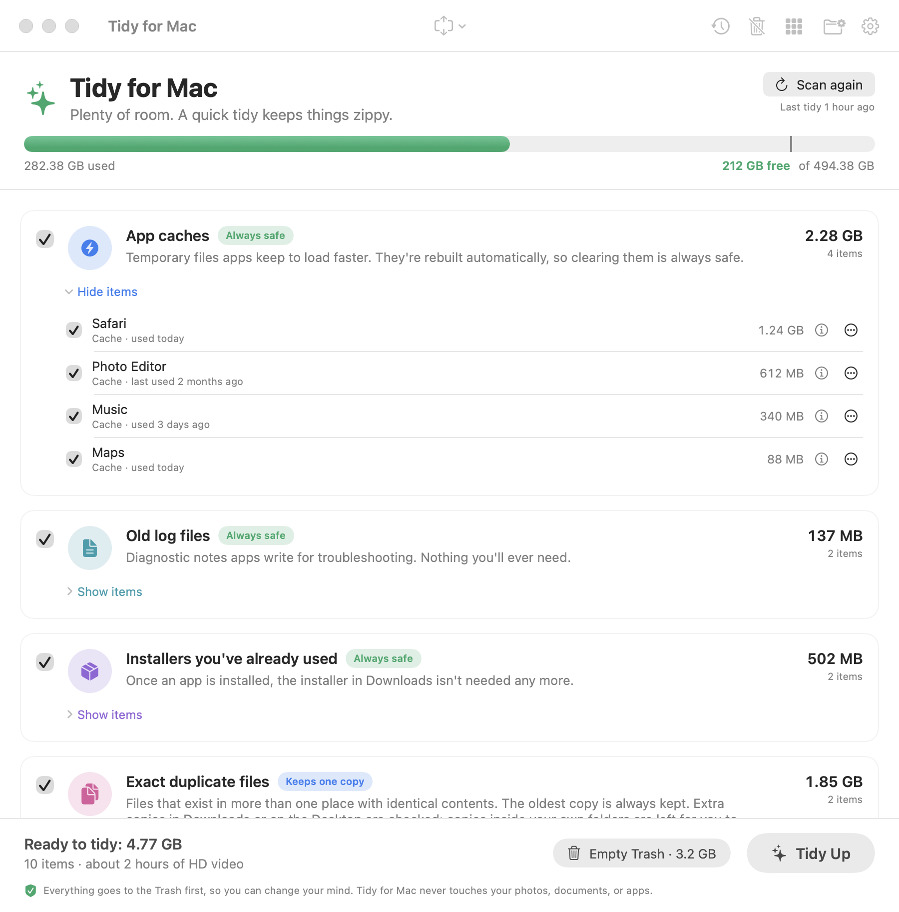
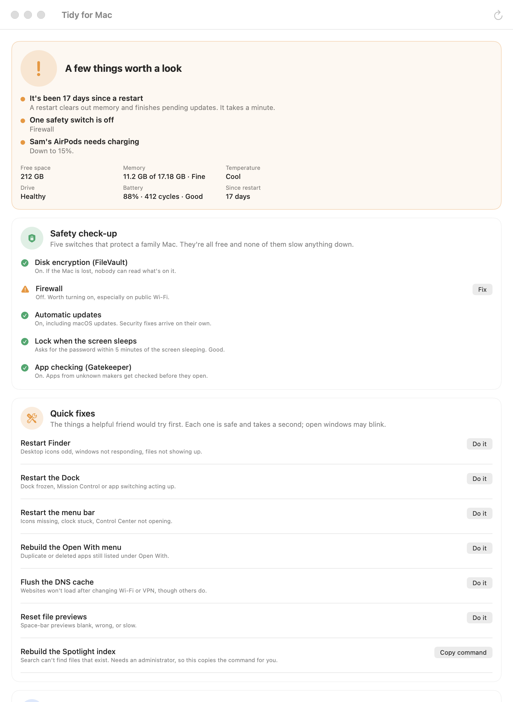
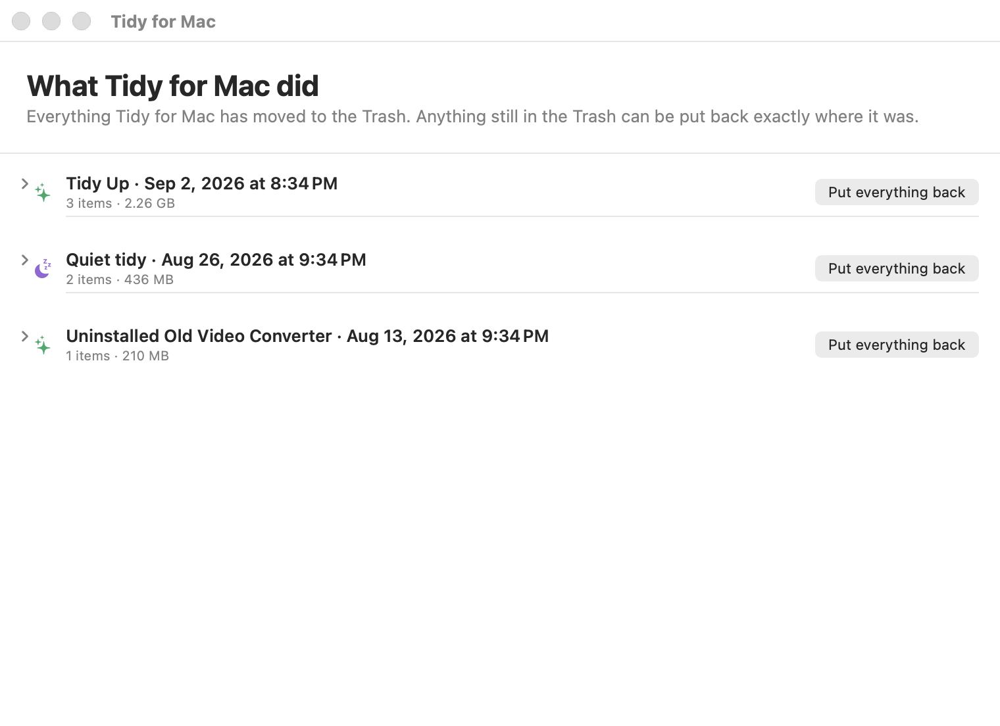
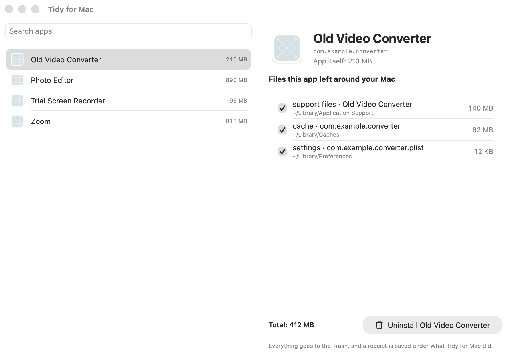
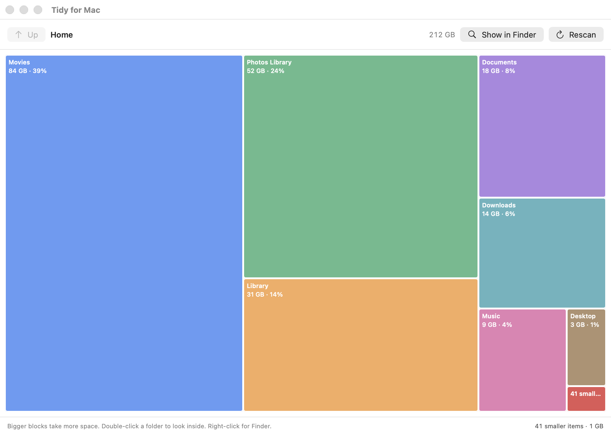
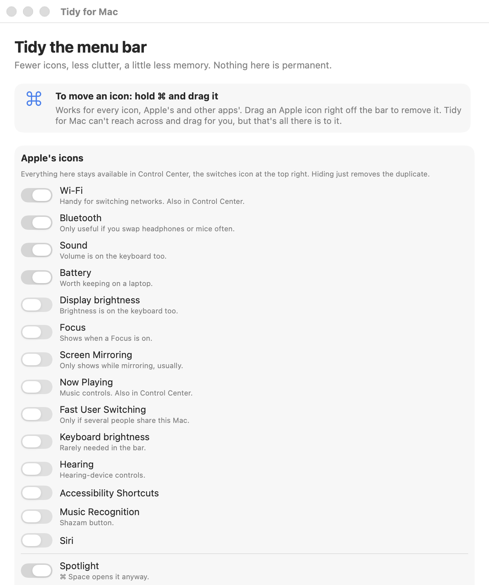
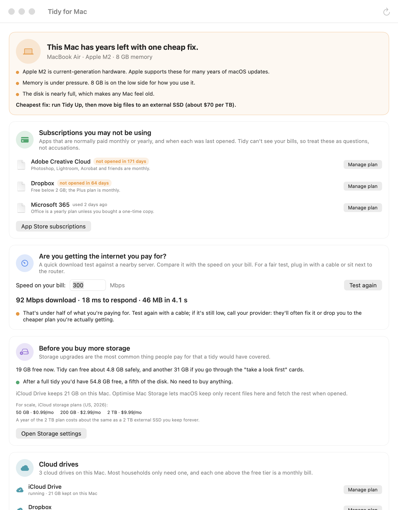
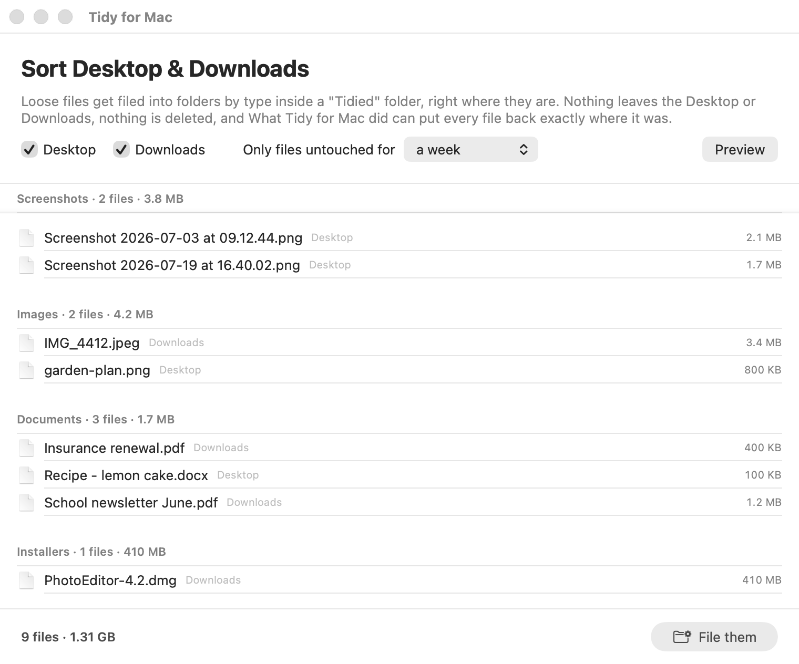

# Tidy for Mac

A friendly, safe cleanup and speed-up app for the whole family. Free and open source (MIT). Native SwiftUI, built with Swift Package Manager.
No Xcode required, only the Command Line Tools.

## Install

Five minutes, no experience needed. Read each step, then do it.

1. **Download it.** Click this link: [Download Tidy for Mac](https://github.com/keithadler/tidymac/releases/latest).
   On that page, look under **Assets** and click the file that ends in **.dmg**. It saves to your Downloads folder.

2. **Open the download.** Click the Downloads icon at the right end of the Dock (or open Finder and choose
   Downloads) and double-click **Tidy-for-Mac-0.3.0.dmg**. A small window opens with the Tidy for Mac icon and
   a folder called Applications.

3. **Drag the icon onto the Applications folder** in that same window. That copies the app onto your Mac.
   You can then close the small window and drag the disk icon on your desktop to the Trash. That doesn't remove
   the app.

4. **Open it the first time.** Open Launchpad (the rocket in the Dock) or your Applications folder and click
   **Tidy for Mac**. macOS will show a message saying it **can't check the app for malicious software** and
   offer only Done or Move to Trash. Click **Done**. This is normal: it happens to every app that isn't sold
   through Apple, and it does not mean anything is wrong.

5. **Tell macOS it's okay, once.** Click the Apple menu at the top-left of the screen, then **System Settings**.
   In the left list click **Privacy & Security**. Scroll the right side all the way down. You'll see a line
   saying "Tidy for Mac" was blocked, with an **Open Anyway** button. Click it, type your Mac password, and
   click **Open**.

6. **That's it.** From now on Tidy for Mac opens like any other app, and macOS never asks again. The first
   time it looks in your Downloads folder, macOS will ask if it may. Click **Allow**.

Works on any Mac running macOS 14 Sonoma or newer. If you're not sure which you have: Apple menu > About This Mac.

**Why the warning?** Apple charges developers $99 a year for the certificate that skips it. This is a free,
open-source project, so it doesn't have one. The whole source code is in this repository for anyone to read.

<details>
<summary>For the technically minded</summary>

Skip the Open Anyway step from Terminal:

```bash
xattr -d com.apple.quarantine "/Applications/Tidy for Mac.app"
```

Or build from source (Command Line Tools only, no Xcode), which also installs the `tidymac` command and its man page:

```bash
git clone https://github.com/keithadler/tidymac.git && cd tidymac && ./build-app.sh --install --run
```

Universal binary, Intel and Apple Silicon.
</details>

## Screenshots

All screenshots are rendered by the app itself from made-up sample data (`--screenshots`), so they
show the real interface without anyone's real files.

| Tidy | Speed |
|---|---|
|  |  |

| Receipts | Uninstall an app |
|---|---|
|  |  |

| Space map | Menu bar |
|---|---|
|  |  |

| Money | Sort Desktop & Downloads |
|---|---|
|  |  |

## What it does

Scans the places macOS lets junk pile up and sorts what it finds into plain-language cards:

| Card | Pre-checked? | What's in it |
|---|---|---|
| App caches | yes | `~/Library/Caches`, minus Apple's own. Caches for apps that are open right now are left unchecked. |
| Old log files | yes | `~/Library/Logs` |
| Installers you've already used | yes, if older than 2 weeks | `.dmg` `.pkg` `.iso` `.xip` in Downloads |
| Developer tool caches | yes | npm, pip, uv, Gradle, Xcode DerivedData, Simulator caches, only if present |
| Leftovers from apps you removed | no, "take a look first" | Settings, support files, containers, and web data whose app no longer exists |
| Old iPhone and iPad backups | no | `MobileSync/Backup`, named by device and date |
| Your biggest files | no | Files over 500 MB in your home folder, excluding Library and app packages |
| Exact duplicate files | only copies in Downloads or Desktop | Content-hash matches; oldest copy kept; git checkouts and node_modules skipped |
| Claude app | caches and old versions, when Claude is closed | Rendering caches, superseded Claude Code versions, sandbox image, transcripts older than a month |
| Apps you haven't opened in a year | no | Spotlight last-used date via `mdls`; App Store apps noted as re-downloadable |

## Speed tab

A second tab beside Tidy, all without privileges:

- **Health verdict**: green / yellow / red with the reasons, plus free space, memory pressure, temperature, drive SMART, battery health and cycles, days since restart.
- **Right now**: apps by memory and CPU with Quit / Force Quit; plain-language banner when Spotlight, Photos, iCloud or Time Machine is busy; restart nudge after 14 days.
- **Startup**: login items (System Events) with one-click removal; user launch agents with an on/off switch (plist parked under `Application Support/Tidy Mac/Disabled Agents`, receipt saved); all-user agents shown read-only.
- **Browser weight**: Chromium-family profiles with site-data size, Clear site data (browser must be closed), extension list with sizes, Manage extensions deep link.
- **Storage tricks**: the 10%-free guardrail (also drawn on the Tidy gauge), purgeable space, deep links to Optimise Mac Storage, auto-empty Trash, Mail attachments.
- **Updates**: `softwareupdate -l` in the background, deep links to Software Update and App Store updates.
- **Lighter look**: Reduce Motion / Reduce Transparency status with deep links.
- **Wi-Fi and internet**: band, signal, rate, DNS lookup time, router ping, with "5 GHz is available" and slow-DNS hints (`system_profiler SPAirPortDataType`, `dig`, `ping`).
- **Cloud sync**: iCloud Drive, Dropbox, Google Drive, OneDrive; "stuck" when CPU stays high for 20 s; restart or nudge.
- **Time Machine**: destination, last backup age, local snapshot count; thinning handed off as a copyable sudo command.
- **Apps that update themselves**: reads each app's Sparkle feed (SUFeedURL) or Google's version API; App Store apps noted separately.
- **Intel-only apps**: parses Mach-O headers on Apple Silicon and lists apps with no arm64 slice.
- **Menu bar apps and widgets**: accessory-policy apps and running widget extensions with memory, Quit button.
- **Printers**: `lpstat` queues, stuck jobs (`cancel -a`), remove (`lpadmin -x`, falls back to a settings link when admin is needed).
- **Battery habits**: charge, power source, Low Power Mode, display sleep, with advice.
- **Sleep and wake**: who is keeping the Mac awake (`pmset -g assertions`), recent wake reasons in plain language (`pmset -g log`), scheduled events, and the wake-for-network / Power Nap / proximity switches.
- **Drive speed**: 256 MB uncached write/read test per volume with a plain verdict; the test file is removed.
- **Safety check-up**: FileVault (`fdesetup`), firewall (`socketfilterfw`), automatic updates, screen lock (`sysadminctl`), Gatekeeper (`spctl`), each with a Fix link.
- **Device batteries**: Bluetooth peripherals from `system_profiler SPBluetoothDataType`, low-battery warning under 20%.
- **Which app opens what**: default app for web, email, PDF, JPEG, text via `NSWorkspace`, changeable from a menu.
- **Quick fixes**: restart Finder / Dock / menu bar, rebuild Open With (`lsregister`), flush DNS, reset Quick Look; Spotlight reindex is copied as a sudo command.

Command line: `tidymac speed` (add `--updates`, `--app-updates`, `--bench` for the slow checks). See [docs/CLI.md](docs/CLI.md).

## Money tab

A third tab about not spending money you don't need to. Everything is phrased as "if you're paying
for this", because the app can't see bills, and prices are quoted as typical and dated.

- **Is this Mac done?** A fair verdict from chip generation, memory pressure, disk, thermal state and
  battery, with the cheapest fix named. No upsell.
- **Subscriptions you may not be using**: apps that are normally paid monthly, with Spotlight's
  last-opened date, and a Manage plan link to each vendor and to App Store subscriptions.
- **Are you getting the internet you pay for?** A download test against Cloudflare, compared with the
  speed you type from your bill.
- **Before you buy more storage**: free space plus what a tidy would free, against iCloud tier prices
  and the cost of an external SSD.
- **Cloud drives**: iCloud Drive, Dropbox, Google Drive, OneDrive, Box; flags when more than one is
  installed.
- **Does the battery need replacing?** Apple's 80% threshold and 1,000-cycle rating, applied to this
  battery, so nobody sells you one you don't need.
- **Things your Mac already does for free**: paid apps that overlap with Preview, Notes, Passwords,
  Pages, the Screenshot tool, Archive Utility, or built-in protection.

## Sort Desktop & Downloads

Window > Sort Desktop & Downloads (⇧⌘S). Loose files untouched for a week (or a month, or three)
are filed by type into a `Tidied` folder right where they are. Moves, never trashes; the receipt
puts every file back exactly. Also `tidymac sort`.

## Checkup report

The toolbar's document button (or `tidymac report`) writes one HTML page: health verdict, safety,
what a tidy would free, money findings, and what was done in the last 30 days. Made for handing to
whoever does the family's tech support.

## Menu bar window

Window > Tidy the Menu Bar (⇧⌘B), also from the Speed tab and the sparkle menu. Toggles for Apple's icons (writes the same Control Center preferences System Settings does, then restarts Control Center), Spotlight, and Tidy for Mac's own icon; for other apps' icons: open their settings, stop them at login, or quit them. Reordering is ⌘-drag, explained in place. Points to Ice for collapsing icons since macOS has no built-in way.

## Extra windows

What Tidy for Mac did (receipts and put-back), Uninstall an App (drag an app in), Space Map (treemap of home), Disk Map (advanced). Settings: menu bar, launch at login, weekly quiet tidy, reminders, protected folders. English and Spanish.

## Safety rules

- Everything goes to the Trash with `FileManager.trashItem`. Nothing is deleted outright.
- Emptying the Trash is a separate button with its own plain-language warning. It asks Finder to do it.
- Photos, documents, and apps themselves are never candidates.
- Apple system caches and preferences are skipped.
- Leftover detection requires a reverse-DNS bundle ID that LaunchServices can't resolve, whose vendor
  has no other installed app, untouched for 30 days. Two-part IDs are treated as too ambiguous.

## Requirements and what adapts

macOS 14 Sonoma or later, Intel or Apple Silicon (the build script produces a universal app).
Older systems get the standard "requires macOS 14" alert from macOS itself.

Tidy for Mac checks what this Mac can do at launch (`Capabilities.swift`) and never shows a control
it can't back up:

- Desktops hide the battery cards; Macs without Wi-Fi get an "Internet" card without signal data.
- Intel Macs hide the Rosetta card. Apple Fabric storage reports "not reported" for SMART.
- A missing command-line tool turns its check into "can't be checked on this Mac" and removes the
  related quick fix, rather than showing "off".
- If the Control Center preference layout isn't one Tidy for Mac recognises, the menu bar toggles are
  disabled and the System Settings link is offered instead.
- Declining the Automation prompt (System Events or Finder) shows an explanation and an Allow
  button instead of an empty list or a silent failure.
- System Settings pane links fall back to opening System Settings when a pane id has moved.

## Releasing

`./make-dmg.sh` builds a universal, ad-hoc signed app and wraps it in `build/Tidy-for-Mac-<version>.dmg`
with an Applications shortcut and a first-open note. Upload it with
`gh release create v<version> build/Tidy-for-Mac-<version>.dmg`. With a Developer ID, sign with
`SIGN_IDENTITY` and run `notarize.sh` first so the first-open warning disappears.

## Build and run

```bash
./build-app.sh --run            # build/Tidy for Mac.app
./build-app.sh --install --run  # also copy to /Applications
```

## Command line

The same binary answers to `tidymac` (not `tidy`, which macOS already uses for HTML Tidy), installed as a symlink by `./build-app.sh --install` with a man page.
Every command shares the app's scanners and actions, and `--json` works everywhere.

```bash
tidymac scan                          # what could be tidied, changes nothing
tidymac up --safe --dry-run           # the plan for the always-safe cards
tidymac up --safe --yes               # do it; receipt saved
tidymac speed                         # health verdict; exit 0 green, 1 yellow, 2 red
tidymac speed --json --card safety    # one card, for scripts
tidymac receipts && tidymac restore last # undo
tidymac disk                          # the boot-volume map
tidymac money --speedtest --plan 300   # the Money tab, with an internet speed test
tidymac sort --dry-run             # what the Desktop/Downloads sorter would file
tidymac report --open              # the monthly checkup page
tidymac screenshots docs/screenshots  # regenerate the README images from sample data
```

Full reference with exit codes and examples: [docs/CLI.md](docs/CLI.md), or `man tidymac`.

## Advanced: Disk Map

Window > Disk Map (⇧⌘D) opens the boot-volume map: physical disk → partition → APFS container →
volumes → the sealed snapshot macOS is booted from, color-coded by data type.

## Layout

```
Sources/TidyMac/
  TidyMacApp.swift    app entry: cleanup window, Disk Map window, text-mode hooks
  CleanupModel.swift  categories, items, phases, actions
  Scanner.swift       all file-system scanning, trash, empty-trash
  CleanupView.swift   header gauge, category cards, footer, confirmation sheets
  DiskUtil.swift      diskutil wrapper for the Disk Map
  DiskModel.swift     disk map types
  ContentView.swift   Disk Map UI
  Theme.swift         Disk Map colors
  Dump.swift          --dump and --scan text output
icon/make-icon.swift  renders AppIcon.icns with AppKit (run: swift icon/make-icon.swift && iconutil -c icns icon/TidyMac.iconset -o AppIcon.icns)
```

## Privacy

Tidy for Mac makes no network requests on its own. The only time it talks to the internet is when you
click a button that needs it: "Check app versions" fetches each app's own update feed and Google's
Chrome version API, "Check for macOS updates" asks Apple through `softwareupdate`, and the Wi-Fi card
times one DNS lookup and three pings to your router. There are no analytics, no accounts, and nothing
is uploaded. Receipts and settings stay in `~/Library/Application Support/Tidy Mac`.

## Permissions it may ask for

macOS asks once per app signature and remembers. If you build from source, run
`./make-local-identity.sh` once first; otherwise every rebuild is ad-hoc signed, looks like a new
app to macOS, and gets asked everything again. Released builds signed with a Developer ID never
have this problem.

- **Downloads / Desktop / Documents**: macOS asks the first time a scanner looks there.
- **Control System Events**: to read and remove login items, and to restart when you ask.
- **Control Finder**: only to empty the Trash when you click Empty Trash.
- **Notifications**: only if you turn on reminders or the weekly tidy.
- **Full Disk Access** is never required. Without it the Trash size shows as unknown, Safari's data
  and Mail attachments are not scanned, and that's the whole difference.

## Contributing

See [CONTRIBUTING.md](CONTRIBUTING.md) for the ground rules that keep the app safe, and how to add a card.

## Author

Keith Adler · [@keithadler](https://github.com/keithadler) · keith.adler@icloud.com

## License

MIT. See [LICENSE](LICENSE).

## Trademarks

Mac and macOS are trademarks of Apple Inc., registered in the U.S. and other countries. Tidy for Mac
is an independent project and has not been authorized, sponsored, or otherwise approved by Apple Inc.
Other product names mentioned in the app (Chrome, Dropbox, Google Drive, OneDrive, and so on) are
trademarks of their respective owners and are used only to identify those products.
